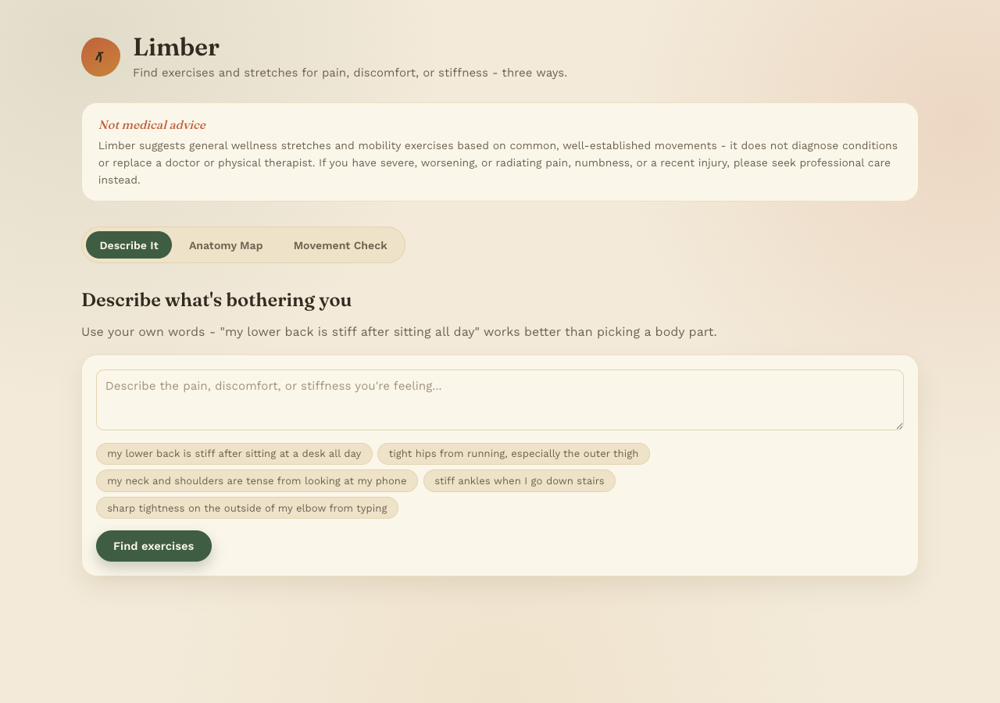
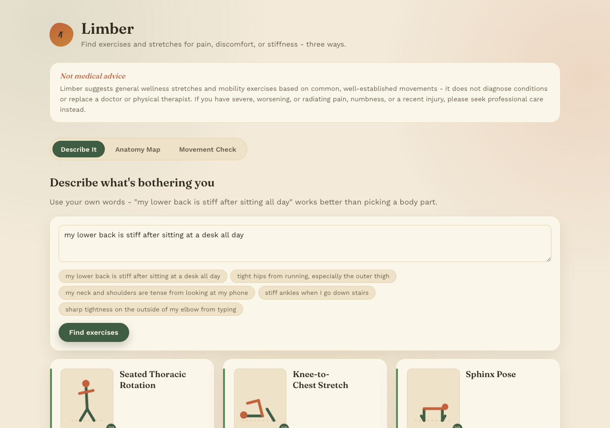
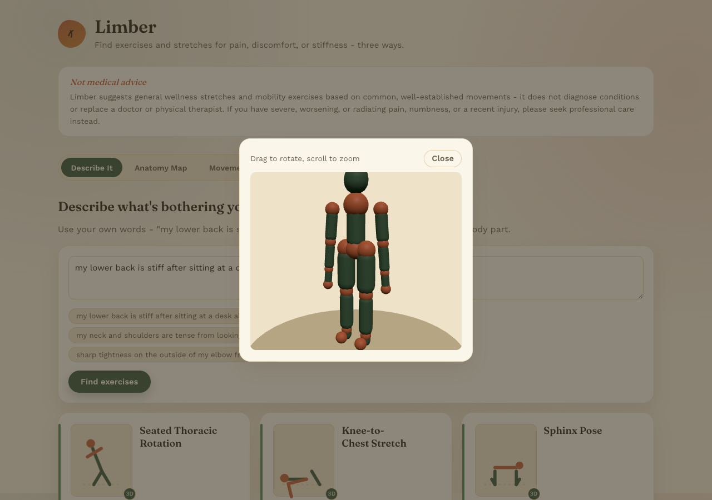
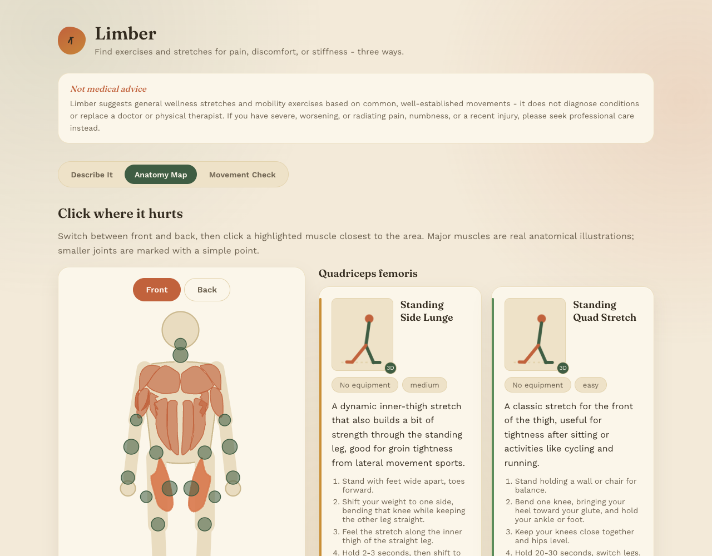
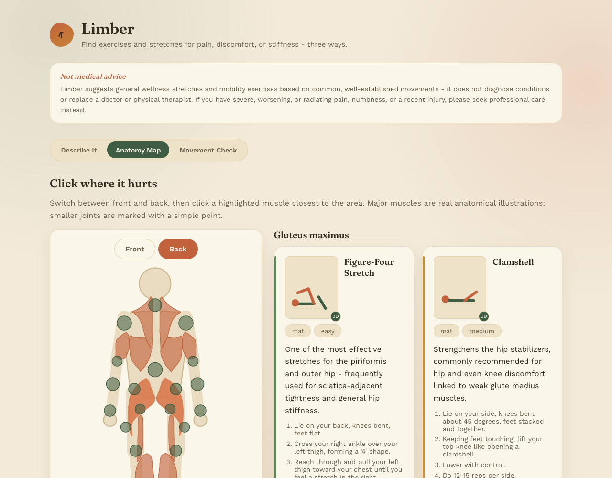
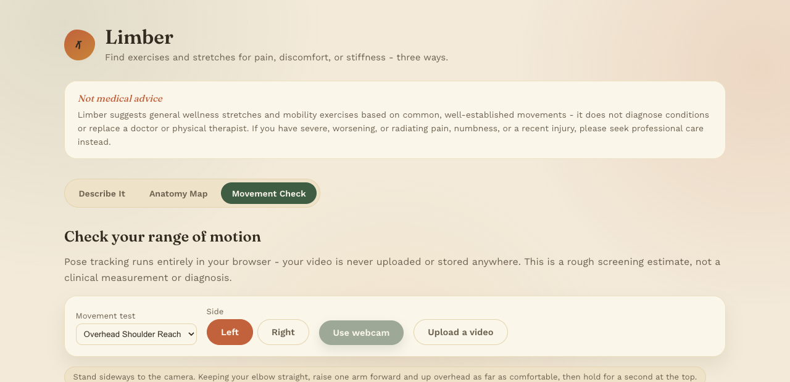

# Limber

A wellness app that suggests exercises and stretches for pain, discomfort, or
stiffness through three different ways of telling it what's wrong: describe it
in your own words, click where it hurts on a body diagram, or let it screen
your range of motion from a short video.

**This is a portfolio/learning project, not a medical product.** See
[Disclaimer](#disclaimer) below.

## The three input modes

**Describe it.** Type something like "my lower back is stiff after sitting at
a desk all day" and get back stretches ranked by actual relevance, not
keyword overlap. A sentence-transformer (`all-MiniLM-L6-v2`) embeds both the
query and every exercise's name/description/target-muscle text into the same
vector space at startup, then ranks by cosine similarity - the same
embed-and-rank pattern used for [Shelf Match](https://github.com/LNakai-OSU/shelf-match)'s
book search, applied to a much smaller, hand-written corpus.

**Click where it hurts.** A body diagram (front and back) shows exercises
tagged to whatever you click. The 15 major muscle groups are real anatomical
illustrations from [wger.de](https://wger.de)'s open exercise database
(CC BY-SA 4.0) - not hand-drawn shapes - aligned onto a simple outline using
the muscles' own shared coordinate system. wger's illustrated set doesn't
cover every clickable region (it's a gym-training database, not a full
anatomical atlas, and no single wall-chart shows all ~600 muscles in the body
either), so smaller joints and areas outside its 15 groups - wrists, ankles,
the jaw, IT band, piriformis, and so on - are marked with a plain point
instead of a fabricated "realistic" shape for something that isn't real
illustration.

**Movement check.** Pick a guided movement (e.g. "raise your arm overhead as
far as comfortable"), and [MediaPipe Pose](https://ai.google.dev/edge/mediapipe/solutions/vision/pose_landmarker)
tracks your joint angle live from your webcam or an uploaded clip - entirely
in the browser via WASM. The peak angle you reach is compared against a
generic, commonly-cited "typical unrestricted range" for that movement, and
if it comes in noticeably lower, you get exercises for that joint. **The
video frames never leave your browser** - only the single peak angle number
is sent to the backend.

Every exercise card also has a small 2D movement icon, and a "3D" button that
opens a real three.js scene: a jointed capsule rig (actual forward-kinematics
hierarchy - shoulder carries elbow carries wrist, the way a skeleton does)
animated through that exercise's movement pattern, which you can drag to
rotate and scroll to zoom. It's a stylized rig, not a photorealistic body -
there's no licensed 3D human model or motion-capture data behind it, just
primitives and real joint rotations.

## Data: hand-curated, not scraped

111 exercises/stretches, covering neck, jaw, shoulders, chest, upper/lower
back, core, hips, glutes, piriformis, IT band, adductors, hamstrings, quads,
knees, shins, calves, ankles, feet, wrists, forearms, upper arm, and elbows,
were written for this project rather than pulled from an existing database.
wger.de's exercise API is real and well-built, but it's a general
gym/strength-training catalog (deadlifts, kettlebell swings), not a
pain-relief/mobility one, so its exercise *content* wouldn't actually answer
"what helps my stiff neck" - its muscle *illustrations*, on the other hand,
are exactly the kind of real anatomical asset worth reusing rather than
redrawing badly by hand (see above).

Each entry includes steps, what it targets, equipment needed, difficulty, and
an honest caution (e.g. "if you feel shooting pain down the leg rather than a
local stretch, stop and consider seeing a clinician").

## What's real vs. approximate

- The semantic search is a genuine embedding model doing genuine similarity
  ranking - not a keyword lookup table.
- The muscle illustrations for the 15 major groups are real anatomical art;
  everything else on the diagram is an honest plain marker, not a fabricated
  illustration.
- The 3D movement viewer is a real, rotatable joint hierarchy with correct
  parent-child rotation, not a photorealistic or motion-captured figure.
- The range-of-motion "normal" values are generic, commonly-cited active-range
  figures (the kind found in physical therapy references), not personalized
  or clinically validated for any individual.
- The ROM angle itself is a simple 2D vector angle computed from three pose
  landmarks in the camera's image plane - it's a reasonable screening proxy,
  not a true 3D biomechanical joint angle, and it's sensitive to camera angle
  and how "sideways" you actually are to the camera.
- Only one person is tracked at a time, and the model runs the lightweight
  MediaPipe pose variant for browser performance, not the most accurate one.

## Tech stack

- **Backend:** FastAPI, sentence-transformers, NumPy
- **Frontend:** React + Vite, `@mediapipe/tasks-vision` (client-side pose
  estimation), `three.js` (3D movement viewer), real anatomical SVGs from
  wger.de layered with hand-placed joint markers
- No database - the exercise/region/ROM-test data is static, hand-authored
  JSON loaded at startup

## Attribution

The 15 major-muscle illustrations in the anatomy diagram (`frontend/src/data/realMuscles.js`)
are © [wger Workout Manager](https://wger.de) contributors, licensed
[CC BY-SA 4.0](https://creativecommons.org/licenses/by-sa/4.0/). Everything
else - the outline, joint markers, exercise content, 3D rig, and code - is
original to this project.

## Screenshots













## Running it locally

```bash
# backend
cd backend
python3 -m venv venv && source venv/bin/activate
pip install -r requirements.txt
uvicorn app.main:app --port 8000

# frontend (separate terminal)
cd frontend
npm install
npm run dev
```

## Disclaimer

Limber suggests general wellness stretches and mobility exercises based on
common, well-established movements. It does not diagnose any condition,
interpret medical images or symptoms, or replace a doctor or physical
therapist. The range-of-motion screening is a rough, browser-based estimate
for general awareness, not a clinical measurement. If you have severe,
worsening, or radiating pain, numbness, or a recent injury, please seek
professional care instead of relying on this app.
